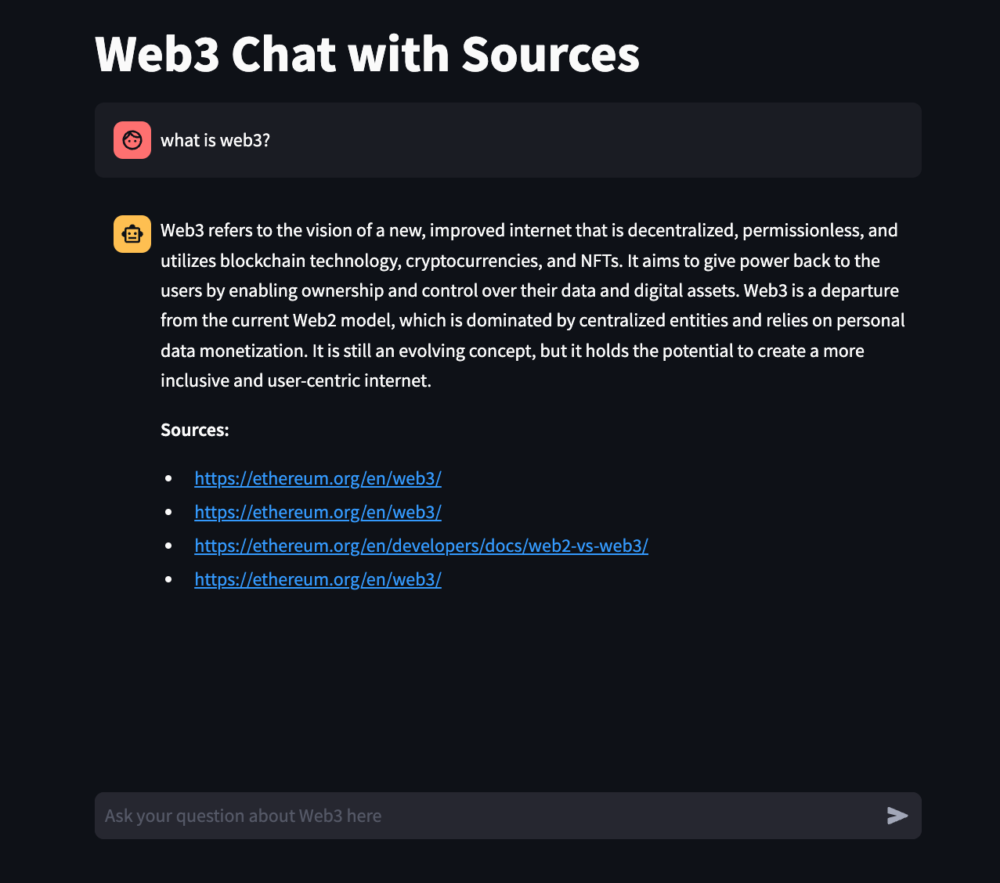

# AI Chatbot for Web3 Questions

## Description
This repository showcases a demo of an AI chatbot that answers questions about Web3. The chatbot uses embeddings from Ethereum.org stored in Pinecone to provide answers based on Ethereum source material, complete with sources. The responses are streamed back to the user in a manner similar to ChatGPT. The app is built with Streamlit and you can check it out for yourself [here]([url](https://chat-web3-app-ivrdgytzd3y8tmkhprkje6.streamlit.app/).

<p align="center">
  
</p>


## Features
1. Streamed Responses: Like ChatGPT, the chatbot streams responses back to the user
2. Ethereum-Based Answers: Utilizes embeddings from Ethereum.org stored via Pinecone vector store
3. Source-Backed: Each answer comes with cited sources for verification

## How to Run Locally
Prerequisites: 1) Python 3.8+, 2) Virtual Environment (optional but recommended) and 3) OpenAI and Pinecone API keys

### Steps

1. **Clone the Repository**

    ```bash
    git clone https://github.com/Zeazy/chat-web3-streamlit.git
    ```

2. **Create a Virtual Environment**

    ```bash
    python -m venv venv
    ```

    **Activate the Virtual Environment**

    - On macOS and Linux:

      ```bash
      source venv/bin/activate
      ```

    - On Windows:

      ```bash
      .\venv\Scripts\activate
      ```

3. **Install Dependencies**

    ```bash
    pip install -r requirements.txt
    ```

4. **Create a Secrets File**

    Create a `.streamlit/secrets.toml` file at the base of the directory.

5. **Add API Keys to `secrets.toml`**

    In the `secrets.toml` file, add your OpenAI and Pinecone API keys in the following format:

    ```toml
    OPENAI_API_KEY = "sk-XXXXXX"
    PINECONE_API_KEY = "XXXXXX"
    ```

6. **Run the App**

    ```bash
    streamlit run app.py
    ```
